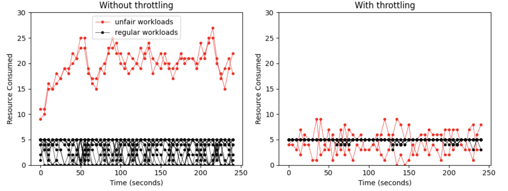

# FAIR


FAIR is a Go library designed to ensure fairness in the resource-constrained environments. It helps distribute the limited resources (e.g., database/blob storage throughput, job execution resources etc.) evenly across multiple clients during the time of shortage, preventing over-allocation and starvation based on client behavior.

## Introduction

The core algorithm of FAIR is based on the [Stochastic Fair BLUE](https://rtcl.eecs.umich.edu/rtclweb/assets/publications/2001/feng2001fair.pdf) often used for network congestion control with a few modifications. The philosophy of FAIR is to only throttle when there's a genuine shortage of resources as opposed to the approaches like token bucket or leaky bucket which may reject requests even when the resource is still available (a creative configuration of FAIR can enable that type of behavior but we don't encourage it). Since the state is stored in a multi-level [Bloom Filter](https://medium.com/p/e25942ab6093) style data structure, the memory needed is constant and does not scale with the number of clients. When properly configured, FAIR can scale to a very large number of clients with a low probability of false positives and a near zero probability of persistent false positives thanks to the hash rotation mechanism that regularly rehashes clients to avoid any correlated behavior longer than a few minutes.

### Key Features

- Framework and protocol agnostic and easy to integrate into any HTTP/GRPC service.
- Automatic tuning with minimal configuration out of the box with flexibility to fully tune if needed.
- Scalable to large numbers of clients with constant memory requirements.
- A simple resource and error tracking model that can be easily morphed into many types of throttling scenarios.

### Evaluation



In this example, 20 clients are competing for a resource that regenerates at the rate of 20/s (every data point in the graph is 5s apart). 18 out of 20 clients are "well behaved" because they request a resource every second while the remaining two clients try to get a resource every 100ms which is an "unfair" rate. On the left, we see that when left unthrottled, the two unfair clients grab a disproportionately large amount of resource while the regular workloads starve and get a lot less than 1/s rate. On the right, when throttled with fair, the regular workloads stay virtually unaffected while the unfair ones get throttled. On average, even the unfair workloads get their fair share when seen over larger time periods.

## Installation

To install the FAIR library, use `go get`:

```bash
go get github.com/satmihir/fair
```

## Usage

To use the default config which should work well is most cases:

```go
trkB := tracker.NewFairnessTrackerBuilder()

trk, err := trkB.BuildWithDefaultConfig()
defer trk.Close()
```

If you want to make some changes to the config, you can use the setters on the builder:

```go
trkB := tracker.NewFairnessTrackerBuilder()
// Rotate the underlying hashes every one minute to avoid correlated false positives
trkB.SetRotationFrequency(1 * time.Minute)

trk, err := trkB.Build()
defer trk.Close()
```

For every incoming request, you have to pass the flow identifier (the id over which you want to maintain fairness) into the tracker to see if it needs to be throttled. A client ID for example could be such ID to maintain resource fairness among all your clients.

```go
ctx := context.Background()
id := []byte("client_id")

resp, _ := trk.RegisterRequest(ctx, id)
if resp.ShouldThrottle {
    throttleRequest()
}
```

For any failure that indicates a shortage of resource (which is our trigger to start throttling), you report outcome as a failure. For any other outcomes that are considered failures in your business logic that don't indicate resource shortage, do not report any outcome.

```go
ctx := context.Background()
id := []byte("client_id")

trk.ReportOutcome(ctx, id, request.OutcomeFailure)
```

On the other hand, when you are able to get the resource, you report success.

```go
ctx := context.Background()
id := []byte("client_id")

trk.ReportOutcome(ctx, id, request.OutcomeSuccess)
```

## Tuning

You can use the `GenerateTunedStructureConfig` to tune the tracker without directly touching the algorithm parameters. It exposes a simple interface where you have to pass the following things based on your application logic and scaling requirements.
- `expectedClientFlows` - Number of concurrent clients you expect to your app
- `bucketsPerLevel` - Number of buckets per level in the core structure
- `tolerableBadRequestsPerBadFlow` - Number of requests we can tolerate before we fully shut down a flow

```go
conf := config.GenerateTunedStructureConfig(1000, 1000, 25)
trkB := tracker.NewFairnessTrackerBuilder()

trk, err := trkB.BuildWithConfig(config)
defer trk.Close()
```
